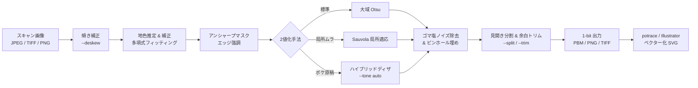

# manga-scan-binarize

[](https://github.com/YosAwed/manga-scan-binarize/actions/workflows/test.yml)
[](https://www.python.org/downloads/)
[](https://opensource.org/licenses/MIT)
[](https://github.com/psf/black)

**漫画のスキャン画像を、網点（スクリーントーン）を保ったまま美しく2値化するツール。**  
potrace や Adobe Illustrator による画像トレース（ベクター化）の前処理として最適化されています。

> **English Summary**: A high-precision CLI tool designed to binarize scanned manga pages while faithfully preserving halftone screentones. It features robust polynomial surface fitting for illumination/paper-tone correction without washing out screentones, automatic spread splitting, margin trimming, and outputs 1-bit PNG, G4-compressed TIFF, or PBM ready for direct feeding into `potrace`. [Jump to English Summary](#english-summary).

---

## 🌟 特徴

- **網点（スクリーントーン）の忠実な保持**  
  大域 Otsu しきい値と多項式補正により、トーンの濃度（15%、35%、60%等）を原画とほぼ同一のパーセンテージで再現。
- **革新的な多項式フィッティングによる地色補正 (`--bg-mode fit`)**  
  一般的なモルフォロジー（クロージング）による背景推定で発生する「広いトーン面の中央が紙と誤認されて白く飛ぶ」問題を完全に解消。
- **見開き自動分割 & 白余白トリミング (`--split`, `--trim`)**  
  見開き中央の綴じ目（gutter）を自動検出し、日本の漫画の読み順に合わせて右ページ（`_r`）と左ページ（`_l`）へ自動分割。
- **potrace / ベクター化への徹底的な最適化**  
  potrace がネイティブ入力できる 1-bit PBM 形式や FAX G4 圧縮 TIFF に対応。`--round-dots` による 1px トゲ除去で、ベクター化後のアンカー数を大幅削減。
- **低解像度・ボケ原稿向けハイブリッドディザ (`--tone auto`)**  
  300dpi などの低解像度で網点がグレーに潰れている箇所を局所分散で自動検知し、エッジを守りつつ Floyd-Steinberg 誤差拡散で打ち直してモアレを防止。
- **線画とトーンのレイヤー分離 (`--layers`)**  
  連結成分の幾何学的特徴から、主線（線画）と独立した網点（トーン）を別々の画像ファイルに分離出力。
- **一発比較シート生成 (`--compare`)**  
  主要な8通りのパラメータ設定をタイル状に並べた比較シートを1秒で生成。最適なパラメータが即座に判明。

---

## 🔄 処理パイプライン



---

## 📥 インストール

### 方法 1: リポジトリをクローンしてラッパーを使用（推奨）

Python 3.9 以上がインストールされている環境で以下を実行します：

```sh
git clone https://github.com/YosAwed/manga-scan-binarize.git
cd manga-scan-binarize

python3 -m venv .venv
./.venv/bin/pip install -r requirements.txt
```

> **Note**: ルートディレクトリの `./mb` は、`.venv` が存在すれば自動的にそれを利用して実行する便利なシェルラッパーです。

### 方法 2: pip でインストールしてコマンド化

```sh
pip install git+https://github.com/YosAwed/manga-scan-binarize.git
# これで manga-binarize コマンドがどこからでも利用可能になります
manga-binarize --help
```

---

## 🚀 クイックスタート & 逆引きレシピ集

### 0. 同梱のサンプル画像ですぐ試す（おすすめ）
リポジトリ内の `samples/` ディレクトリに、著作権フリーな人工漫画スキャン画像が同梱されています。クローン後すぐに動作を確認できます：

```sh
# 単ページの2値化
./mb samples/sample_page.jpg -o out.png --dpi 600

# 見開き画像を左右2ページに自動分割 & 白余白トリム
./mb samples/sample_spread.jpg -O out/ --split --trim --dpi 600

# 設定の効き比べシート（8種類）をタイル状に生成
./mb samples/sample_page.jpg --compare cmp.png
```

### 1. 基本の1枚変換
```sh
./mb 原稿.tif -o 原稿_bw.png
```

### 2. フォルダ内の全スキャンを一括バッチ処理
```sh
./mb scans/*.tif -O out/ --dpi 600
```

### 3. 見開きスキャンを自動分割し、余白をカットする
右ページ（`_r`）と左ページ（`_l`）に自動分割され、周囲の不要な白余白がトリミングされます。
```sh
./mb 見開き.jpg -O out/ --split --trim
```

### 4. 最適な設定を見つける（比較シート作成）
中央付近（または `--crop X Y`）を等倍で切り出し、8通りの主要設定を並べた比較シートを生成します。まずこれを見てパラメータを決めるのが一番の近道です。
```sh
./mb 原稿.tif --compare cmp.png
```

### 5. potrace と連携して超軽量・美麗な SVG を作成する（最強パイプライン）
potrace は PNG を読めないため、`--format pbm` で直接出力します。
```sh
# 1. 2値化 & PBM 出力 & トゲ丸めによるアンカー削減
./mb 原稿.jpg -O out/ --split --trim --round-dots --format pbm

# 2. potrace でベクター化（推奨パラメータ）
potrace -s -t 2 -a 1.3 -O 0.4 out/原稿_r_bw.pbm -o out/原稿_r.svg
```

### 6. Adobe Illustrator で画像トレースする場合
2値化済み PNG を出力し、Illustrator 上で設定します：
```sh
./mb 原稿.tif -o out.png --round-dots
```
- **Illustrator 側の設定**:
  - プリセット: **白黒**（※絶対に「グレースケール」でトレースしないこと。詳細は後述）
  - しきい値: `128`
  - パス: `忠実`（または高め）
  - コーナー: `控えめ`
  - ノイズ: `1px`

### 7. 300dpi など解像度が低く、網点が潰れている原稿
網点がグレーに溶けてしまっているスキャンでは、無理にしきい値を切るとモアレ（干渉縞）が発生します。`--tone auto` を指定すると、解像できている部分はそのまま、潰れた部分のみディザで綺麗に再構築します。
```sh
./mb 低解像度.jpg -o out.png --dpi 300 --tone auto
```

### 8. 線画レイヤーとトーンレイヤーを分離する（実験的機能）
```sh
./mb 原稿.tif -O out/ --layers
# 出力: 原稿_bw.png, 原稿_bw_line.png, 原稿_bw_tone.png
```

---

## 🔬 技術的な解説と精度

### 地色推定にモルフォロジー（クロージング）を使わない理由

漫画の2値化でよく用いられるモルフォロジーのクロージング（白を膨張させて地色を推定する手法）には致命的な弱点があります。  
それは、**「ボケた広いトーン面の中では、そのトーンの明るい部分を紙面と誤認してトーンごと白く飛ばしてしまう」** という現象です。

実測（300dpiスキャン）において、クロージングでは平均濃度 27.5% のトーン面が **黒率 9.7% まで白飛び** しました。  
半径を広げればトーンは飛びにくくなりますが、今度は本のノド（綴じ目）の急激な影に追従できなくなります。

`manga-scan-binarize` の多項式曲面フィッティング（`--bg-mode fit`）は、**インク以外の明るい画素のみを抽出して低次の2次元多項式曲面をロバスト推定** します。これにより、トーン面の濃度を完全に維持したまま、綴じ目の影や照明ムラだけを綺麗に除去できます。

### 精度ベンチマーク

合成テスト原稿（600dpi、網点トーン3段、極細線、小文字、照明ムラ、JPEG圧縮劣化を含む原稿。`tools/make_test.py` で生成、`tools/metric.py` で測定）での画素一致率：

| 地色推定アルゴリズム | 通常原稿 | 綴じ目・照明ムラが強い原稿 |
|---|---|---|
| **多項式曲面 fit（本ツールの既定）** | **99.95%** | **99.87%** |
| クロージング（半径 120px） | 99.08% | 99.15% |
| クロージング（半径 600px） | 99.94% | 93.71% |
| 補正なし | 99.78% | 89.34% |

網点スクリーントーン濃度の再現性（既定設定、通常原稿）：

| トーン種別 | 元画像の真値 (Ground Truth) | 本ツールの2値化出力 |
|---|---|---|
| トーン 15% | 15.9% | **15.8%** |
| トーン 35% | 36.3% | **36.2%** |
| トーン 60% | 60.0% | **60.0%** |

#### ベンチマークの再現手順
```sh
python tools/make_test.py          # test_scan.jpg を生成
./mb test_scan.jpg -o out.png --dpi 600
python tools/metric.py out.png --check
```

---

## ✒️ ベクター化（potrace / Illustrator）のノウハウ

### potrace でのアンカー削減と品質の両立

potrace 1.16 での実測比較（300dpi見開きスキャン、1ページ 1101×1701px、2値化画像を基準）：

| パラメータ | 画素一致率 | アンカー点数 | 出力 SVG 容量 | 特徴 |
|---|---|---|---|---|
| `-t 0 -a 1.0 -O 0.2` | 97.4% | 25,153 | 1.1 MB | 忠実トレース（重い） |
| `-t 2 -a 1.3 -O 0.4` | **96.6%** | **8,996** | **566 KB** | **推奨設定（アンカー1/3・容量半減）** |

> [!TIP]
> 軽量設定にしても一致率の低下はわずか **0.8pt** に留まり、見た目の破綻なくアンカー数が 1/3 まで激減します。  
> 定番とされる `mkbitmap -x -s 2` を挟むパイプラインは、漫画原稿では一致率が低下しファイルサイズが倍増するため推奨しません。

### グレースケールのまま画像トレースしてはいけない理由

Illustrator などの画像トレースをスキャン原画に対して「グレースケールモード」で直接かけると、再現性が大幅に低下します。

| 手法 | 画素一致率 | 理由 |
|---|---|---|
| **2値化してから白黒トレース** | **97.3%** | 輪郭を忠実に追跡するのみ |
| グレースケールのままトレース | **85.9%** | グレー量子化により網点・細線が崩壊 |

グレースケールトレースは中間調を数段階のグレーに量子化して面を囲むため、300dpi程度では 1〜2px の網点は消滅するか隣と結合してベタ化し、1px の細線は周囲の紙色に巻き込まれて消失します。  
先に本ツールで 1-bit に確定させておくことで、トレースエンジンは純粋な輪郭抽出に専念できます。

### 300dpi スキャンの物理的限界について

`--preblur 3 --method fixed --k 100 --sharpen 0` でぼかしを強めるとトーンを完全に消して線画だけを抜くことができますが、**細線や小文字も一緒に消滅します**。  
300dpi では「細線（約1px）」と「網点（約1〜2px）」が物理的に同等のサイズとなるため、周波数フィルタ（ぼかし）で両者を分離することは原理的に不可能です。線画とトーンを完璧に分離したい場合は、**600dpi 以上でのスキャン** を強く推奨します。

---

## ⚙️ コマンドラインオプション一覧

| オプション | 既定値 | 説明 |
|---|---|---|
| **入出力関連** | | |
| `inputs` | (必須) | 入力画像パス（ワイルドカード `scans/*.tif` 対応、日本語パス対応） |
| `-o, --output` | None | 出力ファイル名（入力が1枚のとき有効） |
| `-O, --outdir` | 同階層 | 出力先ディレクトリ |
| `--suffix` | `_bw` | 出力ファイル名に付与する接尾辞 |
| `--format` | `png` | 出力形式: `png`, `tif` (G4圧縮), `pbm` (potrace直接入力用) |
| `--dpi` | 自動/600 | 解像度(dpi)。指定値に応じて全パラメータのピクセル窓サイズが自動スケール |
| **レイアウト補正** | | |
| `--split` | false | 見開き画像を綴じ目で検出して右（`_r`）・左（`_l`）2ページに自動分割 |
| `--trim` | false | 周囲の余白（白地）をインク存在領域で自動カット |
| `--deskew` | false | コマ枠・文字行から傾き（回転角度）を自動推定して水平補正 |
| **地色・照明補正** | | |
| `--bg-mode` | `fit` | 地色推定方式: `fit` (多項式曲面近似・トーン保持) / `close` (モルフォロジー) |
| `--bg-radius` | `600` | クロージング時の探索半径(px@600dpi) |
| `--no-flatfield` | false | 地色補正をスキップする |
| **エッジ & 2値化しきい値** | | |
| `--sharpen` | `0.6` | アンシャープマスクの適用量（0で無効） |
| `--sharpen-radius` | `1.2` | アンシャープマスクの適用半径(px@600dpi) |
| `--method` | `otsu` | しきい値方式: `otsu` (均一地色向け推奨) / `sauvola` (局所適応) / `fixed` (固定) |
| `--window` | `61` | Sauvola法の局所窓サイズ(px@600dpi)。網点ピッチの5倍以上を推奨 |
| `--k` | `0.20` | Sauvola法の感度 k（小さいほど黒が増加）。fixed では 0-255 の閾値 |
| **トーン & ディザ処理** | | |
| `--tone` | `keep` | `keep` (網点そのまま) / `auto` (潰れた所だけディザ) / `dither` (全中間調ディザ) |
| `--auto-std` | `30` | `--tone auto` で網点が残っているとみなす局所標準偏差のしきい値 |
| `--dither-lo` | `70` | ディザ時に完全な黒として保護する輝度（主線保護） |
| `--dither-hi` | `235` | ディザ時に完全な白として保護する輝度 |
| `--preblur` | `0` | しきい値前の事前ぼかし量。網点を消して線画だけ抜く際に使用 |
| **ノイズ処理 & ベクター化最適化** | | |
| `--min-black` | `2` | 除去する孤立黒ノイズ（ゴマ塩）の最大面積(px@600dpi) |
| `--min-white` | `2` | 埋める孤立白ピンホールの最大面積(px@600dpi) |
| `--round-dots` | false | 3x3メディアンで1pxの角・トゲを丸め、ベクター化時のアンカーを激減させる |
| `--layers` | false | 連結成分解析により線画（`_line`）と網点トーン（`_tone`）を分離出力 |
| **チューニング・比較** | | |
| `--compare OUT.PNG` | None | 主要設定8パターンの効き比べシートを画像出力して終了 |
| `--crop X Y` | 中央 | 比較シートで切り出す領域の左上座標 |
| `--crop-size` | `700` | 比較シートで切り出す正方形の一辺長(px) |

---

## 🌐 English Summary

`manga-scan-binarize` is a specialized Python CLI tool built for high-quality binarization of scanned manga pages, specifically engineered as a pre-processing pipeline for vectorization tools like **potrace** and **Adobe Illustrator Image Trace**.

### Key Highlights
1. **Screentone Preservation**: Keeps halftone dots intact without losing tint densities.
2. **Robust Polynomial Surface Illumination Correction**: Replaces traditional morphological closing with a 2D polynomial surface fit on bright pixels, completely solving the notorious issue of large tone areas being washed out as paper background.
3. **Manga Spread Splitting & Auto-Trimming**: Automatically locates gutter whitespace to split spreads in Japanese reading order (Right page `_r` followed by Left page `_l`), with automatic margin trimming.
4. **Vectorization-Ready Outputs**: Direct output of 1-bit PBM (potrace native), CCITT Group 4 TIFF, and 1-bit PNG. Includes `--round-dots` to eliminate single-pixel spikes and reduce potrace anchor counts by up to 65%.

### Quick Usage

```sh
# Clone & install
git clone https://github.com/YosAwed/manga-scan-binarize.git
cd manga-scan-binarize
python3 -m venv .venv && ./.venv/bin/pip install -r requirements.txt

# Try with bundled royalty-free sample images:
./mb samples/sample_page.jpg -o out.png --dpi 600
./mb samples/sample_spread.jpg -O out/ --split --trim --round-dots --format pbm

# Vectorize with potrace:
potrace -s -t 2 -a 1.3 -O 0.4 out/sample_spread_r_bw.pbm -o out/sample_spread_r.svg
```

---

## 📄 ライセンス (License)

This project is licensed under the [MIT License](LICENSE).
Copyright (c) 2024-2026 Yos Awed.
